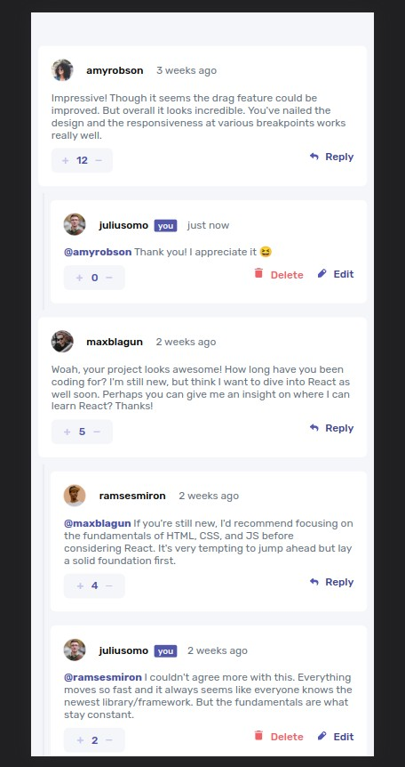

# Frontend Mentor - Comment section solution

This is a solution to the [Interactive comments section on Frontend Mentor](https://www.frontendmentor.io/challenges/interactive-comments-section-iG1RugEG9). Frontend Mentor challenges help you improve your coding skills by building realistic projects. 

### The challenge

My challenge was to build out interactive comment section and get it looking as close to the design as possible.

Here is a list of features that my solutions include:
- Responsive view (implemented solutions for screen lower than 576px and above)
- See hover states for all interactive elements on the page
- Create, Read, Update, and Delete comments and replies
- Upvote and downvote comments

I also fulfilled to extra features:
- **Bonus**: If you're building a purely front-end project, use `localStorage` to save the current state in the browser that persists when the browser is refreshed.
- **Bonus**: Instead of using the `createdAt` strings from the `data.json` file, try using timestamps and dynamically track the time since the comment or reply was posted.

### Screenshot

### Links

- Live Site URL: [Here](https://comment-section.vercel.app/)

### Built with

- Semantic HTML5 markup
- CSS custom properties
- Flexbox
- React

## Author

- Website - [GitHub](https://github.com/mesho254)
- Frontend Mentor - [@mesho254](https://www.frontendmentor.io/profile/mesho254)
- Twitter - [@dimeshak](https://www.twitter.com/@dimeshak)

Any feedback is more than welcome. Feel free to contact me.